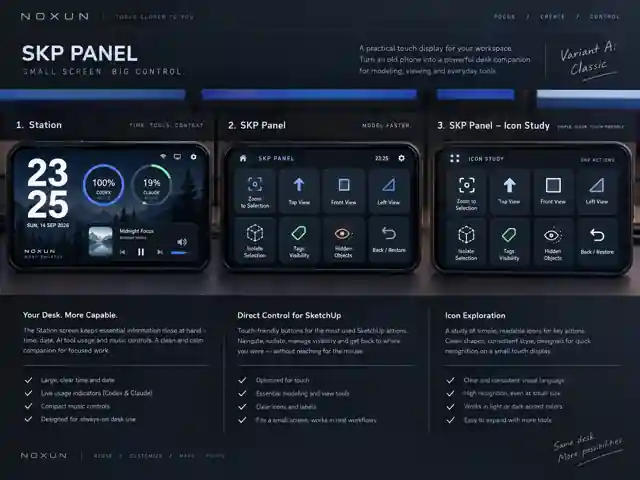
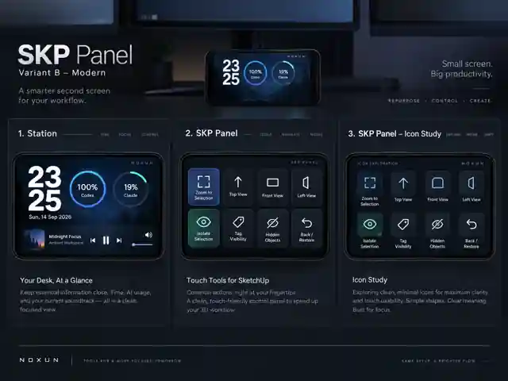
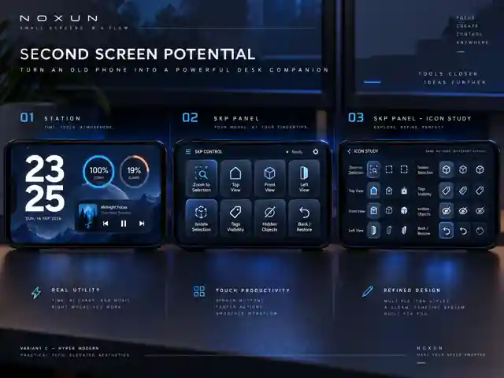

# Vizuálne návrhy

Tri AI-generované koncepčné plachty z úvodnej diskusie. Každá obsahuje Station, SKP panel a štúdiu ikon.

**Rozhodnuté 15. 9. 2026:** základ je **B (Modern)**, posunutý do frosted glass nad fotografiou hmlistého lesa (`app/public/bg.jpg`, originál `docs/assets/bg-original.jpg`). Skutočné rozloženie panela je v [REWORK.md](REWORK.md) a v mocku `app/public/mock3.html`; tieto plachty ostávajú ako úvodná inšpirácia.

V repozitári sú optimalizované náhľady 640 × 480 px; originálne PNG majú 1448 × 1086 px a sú priložené v konverzácii / sprievodnom ZIP balíku. Ide o vizuálnu inšpiráciu, nie snímky fungujúcej aplikácie ani hotové ikony.

## a) Classic

Konzervatívnejší, štruktúrovaný desktopový vzhľad. Zachovaný na porovnanie.

## b) Modern — preferovaný

Čistejší tmavý vzhľad, zaoblené karty a jednoduchšie ikony.

## c) Hyper Modern — preferovaný

Výraznejšie modré akcenty, svetelné hrany a futuristický charakter.

## Čo sa nesmie z mockupov prevziať naslepo

- V SKP musí zostať kompaktný Station pás s časom a usage; plachty ho nezobrazujú dostatočne.
- Claude musí rešpektovať weekly + 5h prstenec, Codex používateľov režim bez 5h. Percentá a dátumy na obrázkoch sú iba ilustratívne.
- Presný význam ikon pohľadov, viditeľnosti a obnovy treba navrhnúť; vygenerovaná ikona nie je funkčná špecifikácia.
- Dotyková veľkosť, kontrast, stavové zvýraznenie a finálne slovenské popisy sa určia na reálnom mobile. Tlačidlá nemenia polohu podľa kontextu.
- Tretia časť je štúdia ikon, nie tretí prevádzkový režim. Prevádzkové režimy zostávajú len Station a SKP.
